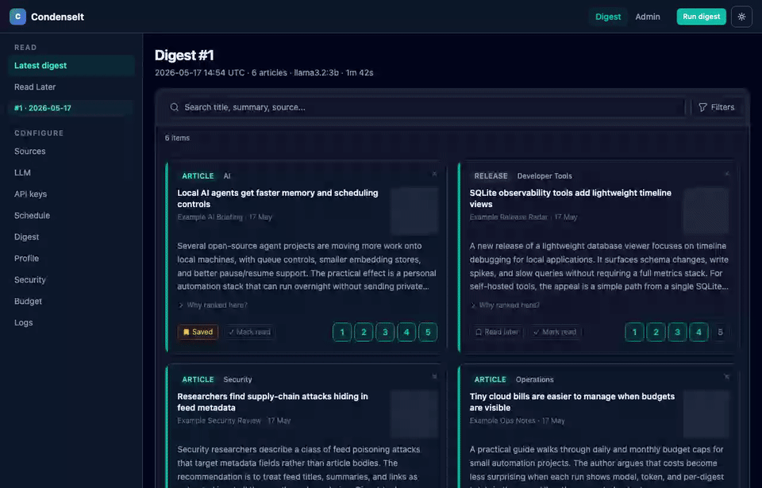

# CondenseIt

> Self-hosted AI news digest. Collect RSS feeds, YouTube channels, website
> diffs, Google News searches, Hacker News, Reddit, GitHub Releases, and podcasts,
> summarize with a local LLM (Ollama) or OpenRouter, learn your preferences
> from star ratings and engagement signals, and read a daily digest in the
> browser.


---

## Preview



---

## Two modes

| | Local | Remote |
|-|-------|--------|
| **LLM** | Ollama on your Mac (Metal) | OpenRouter (cloud) |
| **Scheduling** | `condenseit run` from CLI, or `CONDENSEIT_SCHEDULER_ENABLED=1` | Built-in scheduler (`CONDENSEIT_SCHEDULER_ENABLED=1`) |
| **Setup** | `uv sync` + `condenseit serve` | `bootstrap-server.sh` + `deploy.sh` |
| **Cost** | Free (local hardware) | Pay-per-token via OpenRouter |

Both modes use the same unified web UI: digest reader and admin panel.

---

## What it does

CondenseIt pulls from the sources you configure, scores and summarizes each
article with a local or cloud LLM, ranks articles by your learned preferences,
and produces a daily digest you can read in the browser.

The ranking engine learns from multiple signals:

| Signal | Type | Effect |
|--------|------|--------|
| **Star rating 4-5** | Explicit positive | Boosts matched terms, category, and source |
| **Star rating 1-2** | Explicit negative | Penalises matched terms, category, and source |
| **Mark as read** | Implicit mild positive | Mild boost to category and content profile |
| **Save for later** | Implicit strong positive | Strong boost to category and content profile |
| **Star (permanent save)** | No ranking effect | Saved forever in the Starred page; survives all future digest runs |
| **Dismiss** | Implicit mild negative | Mild penalty to category and content profile |

Scores are additive across multiple named signals: keywords, term overlap,
bigram phrases, TF-IDF cosine, category, source, three implicit channels,
synonym boost, semantic embedding similarity, LLM-extracted topic score, and an
optional LLM rerank pass. Every article card shows a collapsible "Why ranked
here?" breakdown so you can see exactly what drove its position.

**Supported source types** (all configured from Admin > Sources, no API keys needed):

| Type | What it collects |
|------|-----------------|
| **RSS / Atom** | Any RSS or Atom feed URL; extracts `og:image` thumbnails from article pages |
| **YouTube** | Transcripts from channel videos via the public channel RSS feed; attaches video thumbnail |
| **Website watch** | Detects meaningful changes on any web page |
| **Google News search** | Google News RSS search with operator support (`site:`, `when:`, `intitle:`, `source:`) |
| **Hacker News** | Top/best/new/ask/show stories via the public Firebase JSON API |
| **Reddit** | Posts from any public subreddit (hot/new/top/rising, configurable score threshold) |
| **GitHub Releases** | Release notes from any public repository's Atom feed |
| **Podcasts** | New episodes from podcast RSS feeds, with iTunes search to find feed URLs |

### Admin panel

| Page | What it does |
|------|-------------|
| **Sources** | Add/remove all source types; per-source keyword filters (show only, hide, highlight); filter by category; set priority; import/export OPML |
| **LLM** | Provider, model, OpenRouter cheapest-model option, Ollama pull/delete |
| **API keys** | OpenRouter key storage, encrypted at rest in SQLite |
| **Schedule** | Enable/disable automatic digest runs, set daily run times, and view the next scheduled run |
| **Settings** | Article limits, category balance, article age cutoff, language filter, summary format, and **ranking weights** |
| **Preferences** | Learning profile: rating distribution, liked/disliked terms and phrases, category and source scores, implicit signal counts, and time-decay info |
| **Security** | Change the admin password and warn when the default password is still active |
| **Budget** | OpenRouter account usage, local pipeline cost tracking, and daily/monthly budget limits |
| **Logs** | Full output captured from recent digest runs |

---

## Local mode (Ollama on your Mac)

### Prerequisites

- Python 3.11+, [uv](https://github.com/astral-sh/uv)
- [Ollama](https://ollama.ai) installed and running
- Node.js 18+ (for the frontend build)

### Quick start

```bash
git clone https://github.com/wildlifechorus/condenseit
cd condenseit

# Install dependencies
uv sync

# Pull a model
ollama pull llama3.2:3b

# Build the frontend
cd frontend && npm ci && npm run build && cd ..

# Copy and edit config
cp config.example.yaml config.yaml
cp .env.example .env
# Edit config.yaml: add your feeds under the feeds/youtube_channels sections.
# The example defaults to llm.provider: "openrouter" (requires OPENROUTER_API_KEY in .env).
# Change llm.provider to "ollama" if you installed Ollama above.

# Start the web UI
condenseit serve --port 8899
# Open http://localhost:8899

# Run a digest (in a separate terminal, or from the web UI)
condenseit run
```

### Automatic scheduling

Enable the built-in scheduler in `.env`:

```
CONDENSEIT_SCHEDULER_ENABLED=1
```

Then configure run times in **Admin > Schedule** (or set a default in
`config.schedule.times` in `config.yaml`). Changes made in the admin UI take
effect immediately without a restart.

---

## Remote mode (VPS + OpenRouter)

### Prerequisites

- A VPS with Ubuntu/Debian, SSH access, nginx, and python3
- An [OpenRouter](https://openrouter.ai) API key
- A domain pointed at your VPS

### One-time setup

```bash
# Copy config for your domain
cp scripts/nginx/digest.example.com.conf scripts/nginx/your.domain.conf
# Edit the file: replace "digest.example.com" with your domain

# Set VPS connection details in your local .env
echo 'DIGEST_PWA_SSH_HOST=your-ssh-host' >> .env
echo 'DIGEST_PWA_DOMAIN=your.domain' >> .env
echo 'CONDENSEIT_AUTH_PASSWORD=choose-a-strong-password' >> .env

# Bootstrap the VPS (installs condenseit, systemd service, nginx)
./scripts/bootstrap-server.sh
```

The bootstrap script will prompt for your OpenRouter API key, app password,
and scheduler preference, then write everything to `~/condenseit/.env` on
the VPS. Secrets never touch the systemd unit file.

### Deploy

```bash
./scripts/deploy.sh
```

This builds the frontend, packages a wheel, rsyncs everything to the VPS,
and restarts the service. Run again any time you update sources or config.

### TLS

```bash
ssh your-vps 'sudo certbot --nginx -d your.domain'
```

---

## Configuration

See [`config.example.yaml`](config.example.yaml) and [`.env.example`](.env.example)
for all options with inline comments.

Detailed setup guides:

- [Local deployment](docs/deploy-local.md)
- [VPS deployment](docs/deploy-vps.md)
- [Firebase / Cloud Run deployment](docs/deploy-firebase.md)
- [Add to home screen (iOS and Android)](docs/add-to-home-screen.md)

Key `config.yaml` sections:

- `llm` - provider (`ollama` / `openrouter` / `fallback`), model, budget limits
- `feeds` / `youtube_channels` / `watch_urls` - legacy YAML-seeded sources (still supported)
- `schedule.times` - default daily run times (overridden by Admin > Schedule)
- `vps` - SSH target for `scripts/deploy.sh`

All sources (including the new types) are managed from **Admin > Sources** in the web UI and stored in SQLite. The YAML keys above act as initial seeds that are imported once on first run.

Settings also editable live in the admin panel (stored in SQLite, no restart needed):

- **Schedule** - run times
- **Digest** - `max_articles_per_digest`, `balance_digest_categories`,
  `max_articles_per_category`, `max_article_age_hours`,
  `preferred_languages`, `max_key_takeaways`, `max_summary_paragraphs`
- **Ranking weights** - `tfidf_preference_weight`, `category_preference_weight`,
  `source_preference_weight`, `implicit_signal_weight`,
  `rating_decay_half_life_days`, `min_ratings_for_learning`,
  `embedding_preference_weight`, `topic_score_weight`
- **LLM** - provider, model, OpenRouter model, cheapest-model selection
- **Budget** - OpenRouter daily and monthly budget limits
- **Security** - admin password

---

## Preference learning

The ranking engine builds a preference profile from everything you do in the
digest reader. No minimum setup is required; it activates automatically once
you have at least 5 star ratings (configurable via `min_ratings_for_learning`).

**Explicit ratings (1-5 stars)**

- Ratings 4-5 add to the liked term profile, bigram profile, category average,
  and source average.
- Ratings 1-2 penalise those same signals.
- Rating 3 is neutral for terms but still contributes to category/source means.
- All rating rows decay exponentially over time (default half-life: 30 days) so
  stale preferences fade and recent tastes dominate.

**Implicit signals**

Three engagement actions contribute automatically without requiring a star rating:

- **Read** (mark as read): treated as a mild positive (equivalent to ~3.8 stars).
- **Save for later**: treated as a strong positive (~4.5 stars).
- **Dismiss**: treated as a mild negative (~1.5 stars), distinct from "mark as
  read". Dismiss tells the engine you saw the article and were not interested,
  which penalises the article's terms, category, and source in future ranking.

Implicit contributions are scaled by `implicit_signal_weight` (default `0.5`)
so they always have less influence than explicit star ratings.

**Topic synonyms**

Optional synonym groups let the engine propagate profile weight across related
terms without retraining. For example, rating a "kubernetes" article highly will
also boost articles mentioning "k8s" or "helm" when they are in the same
synonym group:

```yaml
relevance:
  topic_synonyms:
    kubernetes: ["k8s", "helm", "kubectl"]
    security:   ["infosec", "cybersecurity", "appsec"]
```

**AI-powered ranking (optional, incremental)**

When an LLM provider is available the engine adds three additional layers on top
of classical ranking. Each layer is independently controlled and off by default:

- **Semantic embeddings** - article text and your liked/disliked articles are
  encoded as vectors. The engine scores each candidate by cosine similarity to
  the centroid of your liked embeddings minus disliked embeddings. Embeddings
  are generated once and cached in SQLite (keyed by URL + content hash), so
  subsequent digest runs are fast. Configure with `embedding_provider`
  (`"ollama"` / `"openrouter"` / `"off"`), `embedding_model`, and
  `embedding_preference_weight`.

- **Topic/entity enrichment** - the LLM already summarizes each article; the
  same call now also extracts `topics`, `entities`, and a `novelty` score
  (1-5). These are persisted in an `article_enrichment` table and used to build
  a topic profile from your ratings. Articles matching liked topics are boosted;
  articles matching disliked topics are penalised. Weight controlled by
  `topic_score_weight`. Topics and a "novel" badge are displayed on each card.

- **LLM reranker** - after classical scoring a compact profile narrative is
  built from your top liked/disliked terms, categories, and sources. The LLM
  is asked to score the top-K candidates (configurable via `llm_rerank_top_k`,
  default 30) by relevance and return a brief reason. The LLM relevance score
  is blended with the classical score (`llm_rerank_blend`, default `0.3`). The
  reason appears in the "Why ranked here?" panel. Enable with
  `llm_rerank_enabled: true` in `config.yaml`.

- **Cold-start bootstrap** - if you have no ratings yet, visit **Admin >
  Preferences** and describe your interests in plain text. The LLM derives
  initial keywords, synonyms, and a profile summary that seed the engine before
  any ratings exist. These are stored in the DB and override YAML defaults.

**Score transparency**

Every article card in the digest shows a collapsible "Why ranked here?" panel
listing each contributing signal as a proportional bar (classical + AI signals).
The **Admin > Preferences** page shows the full learned profile: rating
distribution histogram, liked/disliked terms sized by weight, category and
source bars, bigram phrases, top liked/disliked LLM topics, embedding status,
implicit signal counts, and the current decay weight of your oldest rating.

All ranking weights are adjustable live in **Admin > Digest** without restarting
the server.

---

## Budget tracking

When using OpenRouter, the web UI shows a **Budget** page under Admin with:

- OpenRouter account usage (daily / weekly / monthly credits)
- Local spending broken down by model
- Cost per digest run

Budget limits (`openrouter_daily_budget_usd`, `openrouter_monthly_budget_usd`
in `config.yaml`) stop the pipeline before they are exceeded.

---

## Language filtering

Set preferred languages in **Admin > Settings** (ISO 639-1 codes, e.g. `en`,
`pt`, `de`). Articles in other languages are excluded before ranking. Leave
empty to accept all languages. Uses the `langdetect` library; detection
failures always keep the article.

---

## Development

```bash
uv sync --extra dev
pytest -q
ruff check src tests
cd frontend && npm ci && npm run build
```

---

## License

MIT
