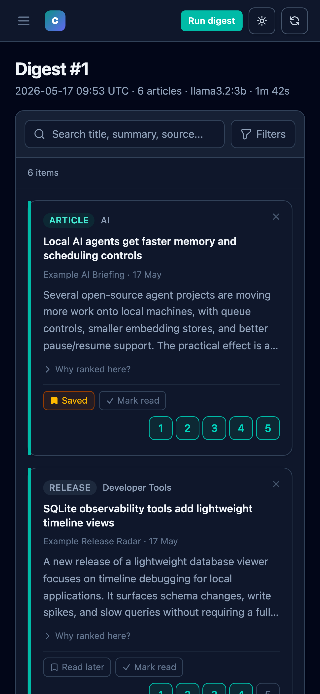

# Deploy locally (your own machine)

CondenseIt runs entirely on your local machine. This is the default mode and
requires no cloud account or paid service.

## Two local setups

| | Native (recommended) | Docker web UI |
|-|----------------------|---------------|
| **LLM** | Ollama (Metal on Mac) or OpenRouter | Ollama on host (via `host.docker.internal`) |
| **Digest runs** | `condenseit run` or built-in scheduler | `condenseit run` on host |
| **Web UI** | `condenseit serve` | Docker container |
| **Data** | `./data/` in repo | `./data/` shared volume |
| **Requirement** | Python 3.11+, uv, Node.js | Docker Desktop |

Both share the same SQLite database at `./data/condenseit.db` so you can
switch between them at any time.

---

## Option A: native install (recommended)

### Prerequisites

| Tool | Version | Install |
|------|---------|---------|
| Python | 3.11+ | [python.org](https://python.org) or `brew install python` |
| uv | latest | `pip install uv` or `brew install uv` |
| Node.js | 18+ | [nodejs.org](https://nodejs.org) or `brew install node` |
| Ollama | latest | [ollama.ai](https://ollama.ai) (skip for OpenRouter-only) |

### 1. Clone and install

```bash
git clone https://github.com/wildlifechorus/condenseit
cd condenseit
uv sync
```

### 2. Pull a language model (Ollama)

```bash
ollama pull llama3.2:3b
```

A 3B model runs well on an M-series Mac. For a more capable model:

```bash
ollama pull llama3.2
```

Skip this step if you plan to use OpenRouter as the LLM provider.

### 3. Copy config files

```bash
cp config.example.yaml config.yaml
cp .env.example .env
```

Edit `config.yaml`:
- Add your RSS feeds, YouTube channels, or watched URLs under the relevant
  sections.
- Set `llm.provider` to `"ollama"` (default) or `"openrouter"`.

Edit `.env`:
- Set `OLLAMA_HOST` if Ollama is not on the default port.
- Set `OPENROUTER_API_KEY` if using OpenRouter.

### 4. Build the frontend

```bash
cd frontend && npm ci && npm run build && cd ..
```

### 5. Start the web UI

```bash
condenseit serve
```

Or with uv:

```bash
uv run condenseit serve
```

Open [http://localhost:8899](http://localhost:8899).

The mobile layout keeps the same digest actions available for narrow screens.
This screenshot uses generated demo data.



### 6. Run a digest

From the web UI header, click **Run digest**. Or from a second terminal:

```bash
condenseit run
```

### 7. Enable the built-in scheduler (optional)

Add to `.env`:

```
CONDENSEIT_SCHEDULER_ENABLED=1
```

Then restart the server. Digests will run automatically at the times set in
`config.schedule.times` (default `07:00` and `18:00`). No cron or launchd
entry needed.

### Changing ports

```bash
condenseit serve --port 9000
```

Update your browser bookmark and the `proxy` target in
`frontend/vite.config.ts` if you develop the frontend.

---

## Option B: Docker (web UI only)

Docker runs the web interface in a container. Digest runs and Ollama stay on
the host so Metal GPU acceleration is preserved.

### Prerequisites

- Docker Desktop 4.x or newer.
- Ollama running on the host.

### 1. Copy config files

```bash
cp config.example.yaml config.yaml
cp .env.example .env
```

### 2. Start the container

```bash
make docker-up
# or: ./scripts/docker-up.sh
```

Open [http://localhost:8899](http://localhost:8899).

The container shares `./data/` with the host so digests run natively appear
in the UI immediately.

### 3. Run a digest on the host

While the container is running, run the digest on the host (uses Metal GPU):

```bash
./scripts/run-with-ollama.sh
# or: condenseit run
```

### Stop the container

```bash
make docker-down
# or: ./scripts/docker-down.sh
```

---

## LLM provider comparison

| Provider | Cost | Privacy | GPU required |
|----------|------|---------|-------------|
| Ollama (local) | Free | All data stays on device | Yes (or slow CPU) |
| OpenRouter | Pay-per-token | Sends article text to cloud | No |
| Fallback | Free first, cloud on error | Mixed | Optional |

Set in `config.yaml`:

```yaml
llm:
  provider: "ollama"        # local only
  # provider: "openrouter"  # cloud only
  # provider: "fallback"    # ollama first, openrouter on error
```

---

## Using OpenRouter without Ollama

If you do not have a GPU or Ollama installed:

1. Create a free [OpenRouter](https://openrouter.ai) account and generate a key.
2. Add to `.env`:
   ```
   OPENROUTER_API_KEY=sk-or-...
   ```
3. Set in `config.yaml`:
   ```yaml
   llm:
     provider: "openrouter"
     openrouter_model: "openai/gpt-4o-mini"
     openrouter_daily_budget_usd: 0.50
     openrouter_monthly_budget_usd: 5.0
   ```
4. Start the server and run a digest normally.

The Budget page in the admin panel tracks spending.

---

## Data directory

All persistent data lives under `./data/` (or `CONDENSEIT_DATA_DIR`):

```
data/
  condenseit.db       SQLite database (ratings, read state, digests)
  digests/            Rendered HTML and JSON for each digest run
```

Back this up before uninstalling or wiping the repo:

```bash
cp -r data/ ~/condenseit-backup-$(date +%Y%m%d)
```

---

## Updating

```bash
git pull
uv sync
cd frontend && npm ci && npm run build && cd ..
# Restart condenseit serve
```

---

## Uninstalling

```bash
# Stop the server (Ctrl-C or kill the process)

# Remove the virtualenv and build artifacts
rm -rf .venv frontend/dist frontend/node_modules dist

# Optional: remove your data (irreversible)
rm -rf data/
```
