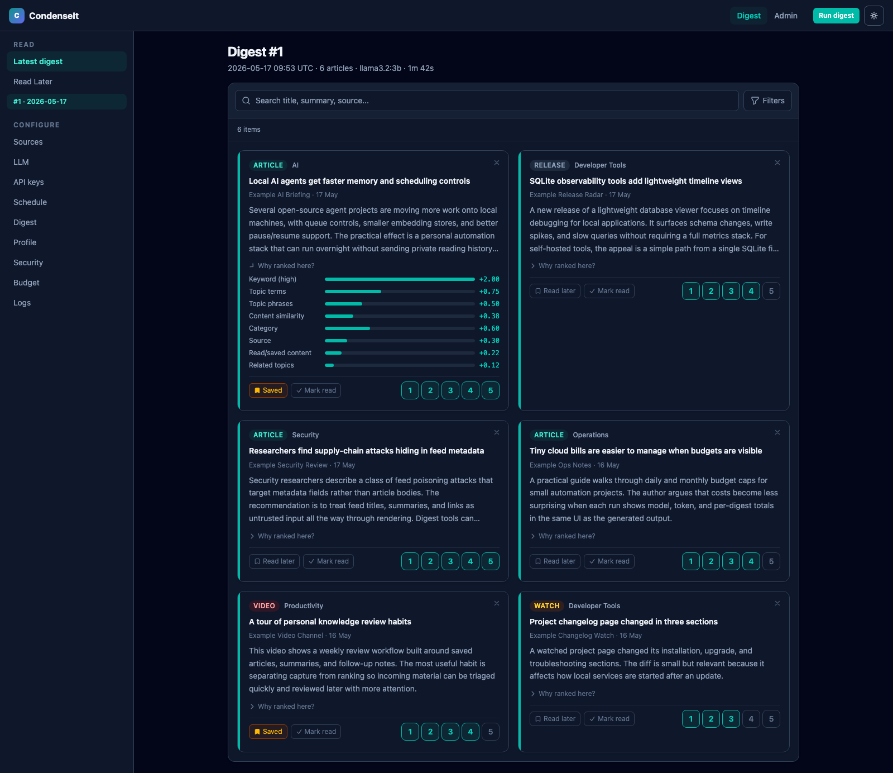

# Getting started

For a full **local install** (uv, `config.yaml`, `.env`, first run), see
[installation.md](installation.md). To run digests automatically, set
`CONDENSEIT_SCHEDULER_ENABLED=1` in `.env` — no cron or launchd needed. See
[scheduling.md](scheduling.md) for details and optional external scheduling.

Quick path:

1. Copy `config.example.yaml` to `config.yaml` and adjust feeds and channels.
2. Choose an LLM backend:
   - **Ollama (local)**: install Ollama on the host (Mac: Metal GPU), pull a model
     (`ollama pull llama3.2:3b`), and set `llm.provider: "ollama"` in `config.yaml`.
   - **OpenRouter (cloud)**: set `llm.provider: "openrouter"` and add
     `OPENROUTER_API_KEY` to `.env`.
   - **OpenAI-compatible server** (LM Studio, vLLM, llama.cpp, etc.): set
     `llm.provider: "openai"`, `llm.openai_base_url` to your server's base URL,
     and `OPENAI_API_KEY` in `.env`.
3. Install deps: `uv sync` (see [installation.md](installation.md)) or a
   venv with `pip install -e ".[dev]"`.
4. Run the web UI: `condenseit serve` (or `make docker-up` for Docker UI only).
5. Run a digest: use **Run digest** in the header, or `uv run condenseit run`
   (or `condenseit run` if your shell uses the project venv).

The web UI gives you the digest reader, rating controls, read-later actions,
and admin pages in one place. This screenshot uses generated demo data.

To open CondenseIt like a native app on your phone, see
[add-to-home-screen.md](add-to-home-screen.md).

See [configuration.md](configuration.md) for YAML and environment variables.

For **Docker UI + host digest**, dry runs, and what each script does, see
[scripts.md](scripts.md).

Optional: `bash scripts/install.sh` (or `bash install.sh` from the repo root)
prints cron and LaunchAgent snippets from your chosen time and cadence (see
[installation.md](installation.md)).
